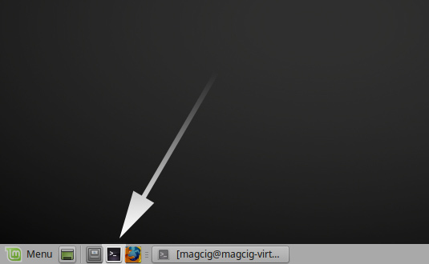
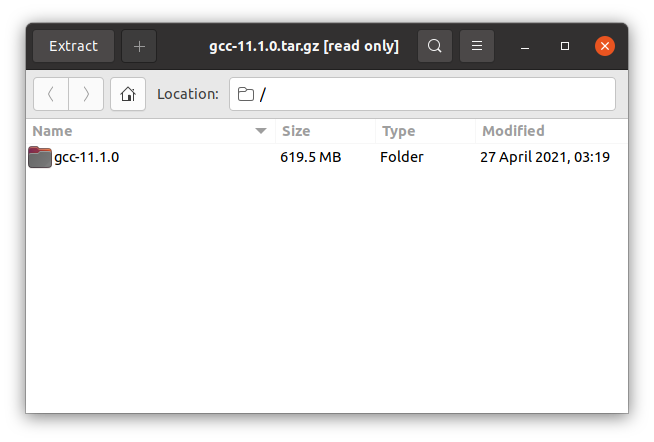

<br><br>

```diff

# This page is not yet complete, I am converting the original guide pages to GitHub markdown.
# ━━━━━━━━━━━━━━━━━━━━━━━━━━━━━━━━━━━━━━━━━━━━━━━━━━

```

[Page 1  Intro](https://tutorialforlinux.com/2021/08/27/step-by-step-gcc-11-2-linux-mint-20-installation/
               "https://tutorialforlinux.com/2021/08/27/step-by-step-gcc-11-2-linux-mint-20-installation/")
([archive](https://web.archive.org/web/20220716150529/https://tutorialforlinux.com/2021/08/27/step-by-step-gcc-11-2-linux-mint-20-installation/
         "https://web.archive.org/web/20220716150529/https://tutorialforlinux.com/2021/08/27/step-by-step-gcc-11-2-linux-mint-20-installation/"))

[Page 2  Downloading GCC](https://tutorialforlinux.com/2021/08/27/step-by-step-gcc-11-2-linux-mint-20-installation/2/
               "https://tutorialforlinux.com/2021/08/27/step-by-step-gcc-11-2-linux-mint-20-installation/2/")
([archive](https://web.archive.org/web/20220716150545/https://tutorialforlinux.com/2021/08/27/step-by-step-gcc-11-2-linux-mint-20-installation/2/
         "https://web.archive.org/web/20220716150545/https://tutorialforlinux.com/2021/08/27/step-by-step-gcc-11-2-linux-mint-20-installation/2/"))

[Page 3  Installing Requirements](https://tutorialforlinux.com/2021/08/27/step-by-step-gcc-11-2-linux-mint-20-installation/3/
               "https://tutorialforlinux.com/2021/08/27/step-by-step-gcc-11-2-linux-mint-20-installation/3/")
([archive](https://web.archive.org/web/20220716150557/https://tutorialforlinux.com/2021/08/27/step-by-step-gcc-11-2-linux-mint-20-installation/3/
         "https://web.archive.org/web/20220716150557/https://tutorialforlinux.com/2021/08/27/step-by-step-gcc-11-2-linux-mint-20-installation/3/"))

[Page 4  Installing GCC](https://tutorialforlinux.com/2021/08/27/step-by-step-gcc-11-2-linux-mint-20-installation/4/
               "https://tutorialforlinux.com/2021/08/27/step-by-step-gcc-11-2-linux-mint-20-installation/4/")
([archive](https://web.archive.org/web/20220716150610/https://tutorialforlinux.com/2021/08/27/step-by-step-gcc-11-2-linux-mint-20-installation/4/
         "https://web.archive.org/web/20220716150610/https://tutorialforlinux.com/2021/08/27/step-by-step-gcc-11-2-linux-mint-20-installation/4/"))

[Page 5  Switching](https://tutorialforlinux.com/2021/08/27/step-by-step-gcc-11-2-linux-mint-20-installation/5/
               "https://tutorialforlinux.com/2021/08/27/step-by-step-gcc-11-2-linux-mint-20-installation/5/")
([archive](https://web.archive.org/web/20220716150624/https://tutorialforlinux.com/2021/08/27/step-by-step-gcc-11-2-linux-mint-20-installation/5/
         "https://web.archive.org/web/20220716150624/https://tutorialforlinux.com/2021/08/27/step-by-step-gcc-11-2-linux-mint-20-installation/5/"))

```diff
# ━━━━━━━━━━━━━━━━━━━━━━━━━━━━━━━━━━━━━━━━━━━━━━━━━━
```

<br><br><br><br>

<div align="middle">

# <br>Step-by-step – GCC 11.2 Linux Mint 20 Installation

**August 27, 2021 | By the+gnu+linux+evangelist**

<!-- ━━━━━━━━━━━━━━━━━━━━━━━━━━━━━━━━━━━━━━━━━━━━━━━━━━ -->

## <br>Page 1 · GNU/Linux Mint 20 Installing GCC 11.2 from Source – Quick-Start Guide

</div>

Hi! The Tutorial shows you Step-by-step **How to Install the GNU Compiler Collection 11.2.x from Source in GNU/Linux Mint 20.x Ulyana/Ulyssa/Uma/Una LTS Desktop**.

And the **GCC 11.2 for Linux Mint 20** is a Compilers Collection currently supporting C, C++, Objective-C, Objective-C++, Fortran, Ada, D, Go, and BRIG (HSAIL) Languages.

Finally, **GCC 11.2** includes several **New Features, Canges, and Fixes** that you can consult on the **[GNU GCC Documentation](https://gcc.gnu.org/gcc-11/changes.html "About GCC New Improvements")**.

<div align="middle">
<br>

[](img/gnomePenguinLoveGnu.jpg "Step-by-step – GCC 11.2 Linux Mint 20 Installation")

</div>

<!-- ━━━━━━━━━━━━━━━━━━━━━━━━━━━━━━━━━━━━━━━━━━━━━━━━━━ -->

### <br>1. Launching Terminal

Open a **Shell** Session
(Press “Enter” to Execute Commands)

<div align="middle">

[](img/mateRunTerminal2.jpg "Step-by-step GCC 11.2 Linux Mint 20 Installation Guide - Open Terminal")

</div>

And Update Ubuntu Apt Repository:

    sudo apt update

Authenticate with the User Admin Pass.<br>If Got “User is Not in Sudoers file” then see: How to Enable sudo.

<!-- ━━━━━━━━━━━━━━━━━━━━━━━━━━━━━━━━━━━━━━━━━━━━━━━━━━ -->

### <br>2. Querying **System GCC**

First, find out what the actual System GCC
Play:

    which gcc

**Take Note** of the **PATH** to use after installation for switching the System GCC.
Possibly to Check the current GCC version issue:

    gcc -v

<!-- ━━━━━━━━━━━━━━━━━━━━━━━━━━━━━━━━━━━━━━━━━━━━━━━━━━ -->

<div align="middle">

## <br>Page 2 · Downloading GCC

</div>

<!-- ━━━━━━━━━━━━━━━━━━━━━━━━━━━━━━━━━━━━━━━━━━━━━━━━━━ -->

### <br>3. Downloading GCC 11.2

**Download GCC 11.2 Source Code for GNU/Linux**<br>
[Here](https://bigsearcher.com/mirrors/gcc/releases/ "https://bigsearcher.com/mirrors/gcc/releases/") GCC 11.2 Source tar.gz

Navigate to the 11.2.x Folder to Grab the Package.

<!-- ━━━━━━━━━━━━━━━━━━━━━━━━━━━━━━━━━━━━━━━━━━━━━━━━━━ -->

### <br>4. Extracting GCC 11.2

Then to **Extract GCC 11.2** Archive<br>
If it does Not Open automatically then Double-Click/Right-Click to Open with Archive Manager:


<div align="middle">

[](img/gcc111.png "Step-by-step GCC 11.2 Linux Mint 20 Installation Guide - Extracting")

</div>

Or from Command Line:

    tar xvzf ~/Downloads/gcc-11.*.tar.gz

(But if you are in Trouble to Find it out on Terminal then See: [How to Access Downloads Folder from Browser](https://tutorialforlinux.com/2020/05/04/how-to-access-downloads-folder-from-browser-on-gnu-linux-desktops/ "How to Access the Downloads Folder from Firefox and Google-Chrome Web Browsers in GNU/Linux Distros").)<br>
Finally, if you are in Trouble to Find Out it on Terminal See: [How to Access Downloads Folder from Browser](https://tutorialforlinux.com/2020/05/04/how-to-access-downloads-folder-from-browser-on-gnu-linux-desktops/ "How to Access the Downloads Folder from Firefox and Google-Chrome Web Browsers in GNU/Linux Distros").

<!-- ━━━━━━━━━━━━━━━━━━━━━━━━━━━━━━━━━━━━━━━━━━━━━━━━━━ -->

<div align="middle">

## <br>Page 3. Installing Requirements

</div>

### <br>5. Installing Requirements

<!-- ━━━━━━━━━━━━━━━━━━━━━━━━━━━━━━━━━━━━━━━━━━━━━━━━━━ -->

Now to **Install Required Dependencies**
Now install the Dependency Package with Multilib support with:

    sudo apt install build-essential libncurses-dev bison flex libssl-dev libelf-dev gcc-multilib

Then access the Target Directory:

    cd ~/Downloads/gcc-11.*/

And again to Download the Required Libraries play:

    ./contrib/download_prerequisites


<!--

References

[](href, "title")

-->
